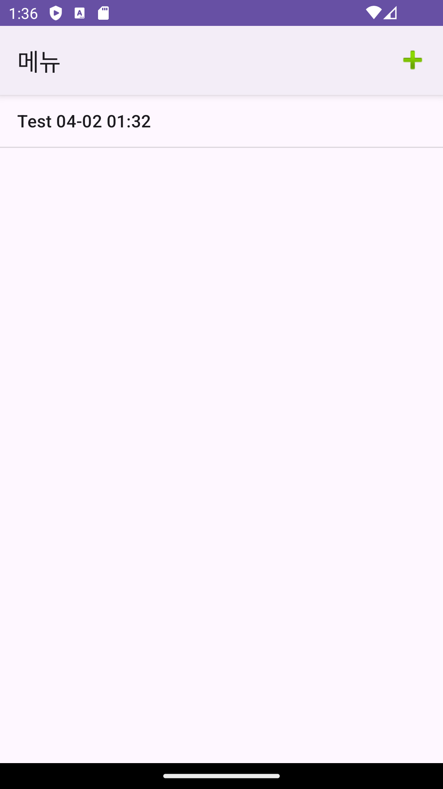
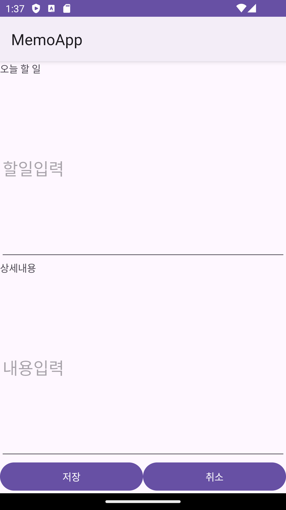
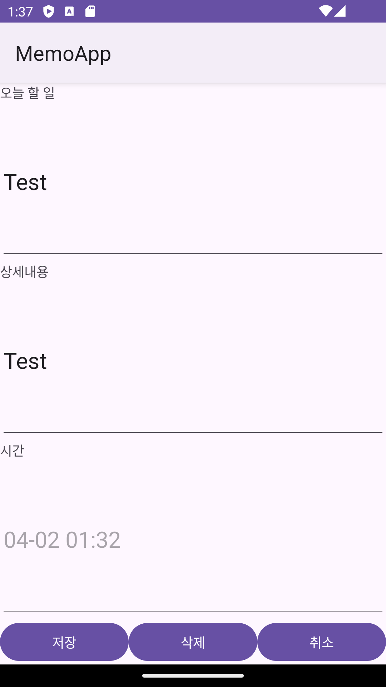
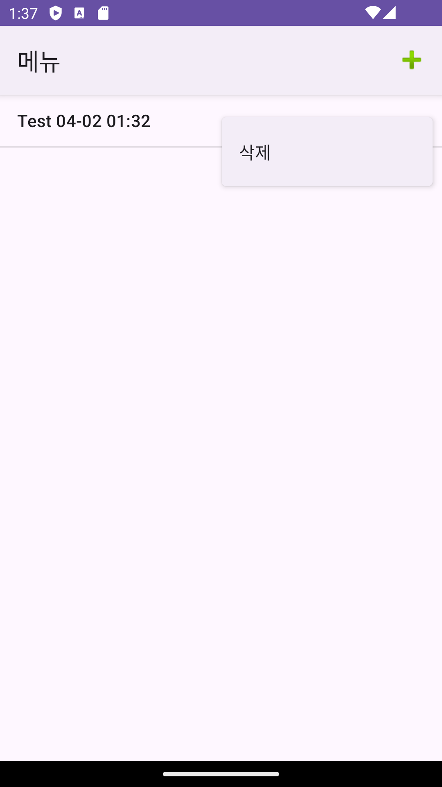
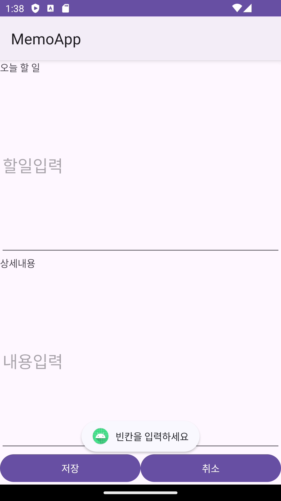

```markdown
# 📝 메모 안드로이드 앱

간단한 메모 앱입니다.  
메모를 추가, 수정, 삭제할 수 있으며, 안드로이드 기본 UI 요소들과 Kotlin을 활용해 구현했습니다.

---

## 🚀 주요 기능

- 📋 메모 리스트 보기 (`ListView`)
- ➕ 메모 추가 (상단 메뉴에서 실행)
- ✏️ 메모 수정 (리스트 항목 클릭)
- 🗑️ 메모 삭제 (리스트 항목 길게 눌러 컨텍스트 메뉴)
- 🕓 등록 시간 표시 (수정 화면에서 확인 가능)

---
```
## 📸 실행 화면

| 메모 리스트 | 메모 작성 | 메모 수정 |
|-------------|-----------|-----------|
|  |  |  |

<br/>

| 삭제 메뉴 | 빈칸 경고 |
|-----------|-----------|
| |  |

---

## 🛠️ 사용 기술

| 항목 | 내용 |
|------|------|
| 언어 | Kotlin |
| UI 요소 | ListView, ContextMenu, OptionsMenu, View Binding |
| Activity 전환 | ActivityResultContracts API |
| 날짜 처리 | SimpleDateFormat, Locale |
| 아키텍처 | 단일 액티비티 기반, 데이터 매니저 사용 |

---
```markdown
## 📁 프로젝트 구조


app/
└── src/
    └── main/
        ├── java/com/heojamong/memo/
        │   ├── MainActivity.kt             # 메인 화면: 메모 리스트 표시 및 메뉴 기능
        │   ├── MemoEditActivity.kt        # 메모 추가 및 수정 화면
        │   ├── MemoItem.kt                # 메모 데이터 모델
        │   └── MemoItemMgr.kt             # 메모 데이터 관리 객체 (add, update, delete 등)
        │
        └── res/
            ├── layout/
            │   ├── activity_main.xml       # 메모 리스트 UI
            │   └── activity_edit.xml       # 메모 작성/수정 UI
            ├── menu/
            │   ├── menu_option.xml         # 상단 옵션 메뉴
            │   └── menu_context.xml        # 리스트 항목 컨텍스트 메뉴
            └── values/
                └── strings.xml 등
```

---

## ⚙️ 실행 방법

1. 이 저장소를 클론합니다.

```bash
git clone https://github.com/heojamong/memo-android-app.git
```

2. Android Studio에서 `memo-android-app` 프로젝트 열기  
3. 에뮬레이터 또는 실제 Android 디바이스에서 실행

---

## 📌 메모 데이터 관리 방식

- `MemoItemMgr`는 메모 리스트를 메모리에서만 관리하는 단순한 객체입니다.
- 앱을 종료하면 데이터는 사라지며, 향후에는 `Room`이나 `DataStore`를 통해 영속 저장소로 확장할 수 있습니다.

---

## ✨ 추가하고 싶은 기능 (To-Do)

- [ ] RecyclerView로 변경
- [ ] Room DB를 이용한 데이터 영구 저장
- [ ] 날짜 정렬, 검색 기능
- [ ] 작성일을 리스트 화면에서도 표시
- [ ] Material Design 적용으로 UI 개선

---

## 🙋‍♂️ 만든 사람

**Heojamong**  
🔗 GitHub: [@heojamong](https://github.com/heojamong)
